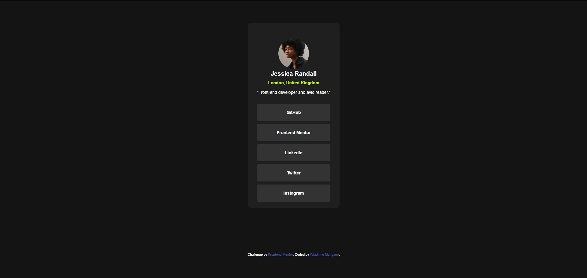

# Frontend Mentor - QR code component solution

This is a solution to the [QR code component challenge on Frontend Mentor](https://www.frontendmentor.io/challenges/qr-code-component-iux_sIO_H). Frontend Mentor challenges help you improve your coding skills by building realistic projects. 

## Table of contents

- [Overview](#overview)
  - [Screenshot](#screenshot)
  - [Links](#links)
- [My process](#my-process)
  - [Built with](#built-with)
  - [What I learned](#what-i-learned)
  - [Continued development](#continued-development)
  - [Useful resources](#useful-resources)
- [Author](#author)
- [Acknowledgments](#acknowledgments)

## Overview

### Screenshot

### Links

- Solution URL: [Add solution URL here](https://github.com/wladimyr/social-links-profile-main)
- Live Site URL: [Add live site URL here](https://wladimyr.github.io/social-links-profile-main/)

## My process

### Built with

- Semantic HTML5 markup
- CSS custom properties
- Flexbox
- Mobile-first workflow

### What I learned

Tive a oportunidade de aplicar meu conhecimento adquirido com o Professor Gustavo Guanabara através dos cursos do site: (https://www.cursoemvideo.com/)

### Continued development

 Maintain my studies in HTML and CSS, always seeking to be up to date with new technologies in the area and, in the future, immerse myself in programming languages ​​such as JavaScript, Python 3, PHP, etc., and also specialize in Artificial Intelligence.

### Useful resources

## Author

- Website - [Wladimyr Garcia Mançano](https://github.com/wladimyr)
- Frontend Mentor - [@wladimyr](https://www.frontendmentor.io/profile/wladimyr)
- Instagram - [@wladimyrmancano](https://www.instagram.com/wladimyrmancano/)
- X - [@Wladimyrgarcia](https://x.com/Wladimyrgarcia)

## Acknowledgments

I would like to thank Professor Gustavo Guanabara [@gustavoguanabara] from the website: (https://www.cursoemvideo.com/) for teaching in a light and extremely didactic way.

